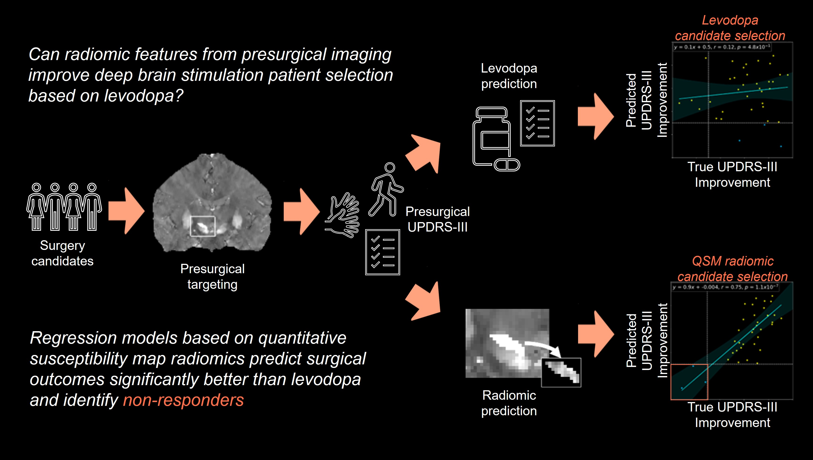

# RadDBS-QSM
Repository for 
>_Technical Feasibility of Quantitative Susceptibility Mapping Radiomics for Predicting
Deep Brain Stimulation Outcomes in Parkinson’s Disease_
>[published](https://pubmed.ncbi.nlm.nih.gov/40965145/)  in [Neurosurgery](https://journals.lww.com/neurosurgery/pages/default.aspx) 
>
>_Radiomic Prediction of Parkinson’s Disease Deep Brain Stimulation Surgery Outcomes using Quantitative Susceptibility Mapping and Label Noise Compensation_ 
>[published](https://www.brainstimjrnl.com/article/S1935-861X(25)00166-4/fulltext) in [Brain Stimulation](https://www.brainstimjrnl.com/)


## Summary
A radiomic model based on presurgical quantitative susceptibility maps (QSM) is used to predict patient outcomes to deep brain stimulation (DBS) surgery for the treatment of Parkinson's diease.

<br/>

<p align="center">
   </br>
   <i>Model overview.</i>
</p>

<br/>

This work presents a framework to: <br/>
* Extract radiomic features for input into a regression model to predict post-surgical motor improvement. <br/>
* Incorporate clinical variables such as age, sex, etc.
* Provide a novel label noise compensation technique improving outcome prediction. <br/>


## Contents
Demonstration code can be found in [`main.ipynb`](https://github.com/agr78/RadDBS-QSM/blob/main/src/jupyter/main.ipynb) <br/>
Radiomic features can be found in [`npy`](https://github.com/agr78/RadDBS-QSM/tree/main/data/npy/rp) <br/>
Customizable extraction code is located in [`extract.py`](https://github.com/agr78/RadDBS-QSM/blob/main/src/jupyter/extract.py) <br/>


## Installation
Clone the repository with
```
git clone https://github.com/agr78/RadDBS-QSM.git
```
Navigate to the repository
```
cd RadDBS-QSM
```
Run the setup script
```
source ./src/install.sh
```
Wait...then open the Jupyter notebook and select the `RadDBS-QSMenv` environment
```
jupyter notebook main.ipynb
```

## Notes
* This tool was developed for use with [QSM](https://mriquestions.com/quantitative-susceptibility.html), but other contrasts may be explored.

* If the QSM has not been reconstructed, [this repository](https://github.com/agr78/mSMV?tab=readme-ov-file#summary) provides code to obtain the whole brain susceptibility.

* If manual region-of-interest masks are not available, [this repository](https://github.com/agr78/mSMV/blob/atlas/README.md) provides bash scripts to create a sample atlas and register individual cases.


## Publications
If this code is used, please cite the following:
> [Neurosurgery Article](https://doi.org/10.1227/neu.0000000000003721): A. G. Roberts et al., "Technical Feasibility of Quantitative Susceptibility Mapping Radiomics for Predicting Deep Brain Stimulation Outcomes in Parkinson’s Disease, 2025, DOI: 10.1227/neu.0000000000003721
> 

## BibTex

```bibtex
@article{Roberts_RadDBS-QSM_2025,
  title    = "Technical feasibility of quantitative susceptibility mapping
              radiomics for predicting deep brain stimulation outcomes in
              Parkinson disease",
  author   = "Roberts, Alexandra G and Zhang, Jinwei and Tozlu, Ceren and
              Romano, Dominick and Akkus, Sema and Kim, Heejong and Sabuncu,
              Mert R and Spincemaille, Pascal and Li, Jianqi and Wang, Yi and
              Wu, Xi and Kopell, Brian H",
  journal  = "Neurosurgery",
  month    =  sep,
  year     =  2025,
  keywords = "Deep brain stimulation; Machine learning; Parkinson disease;
              Quantitative susceptibility mapping; Radiomics; Regression",
  language = "en"
}
```

## Contact
Please direct questions to [Alexandra Roberts](https://github.com/agr78) at agr78@cornell.edu.
